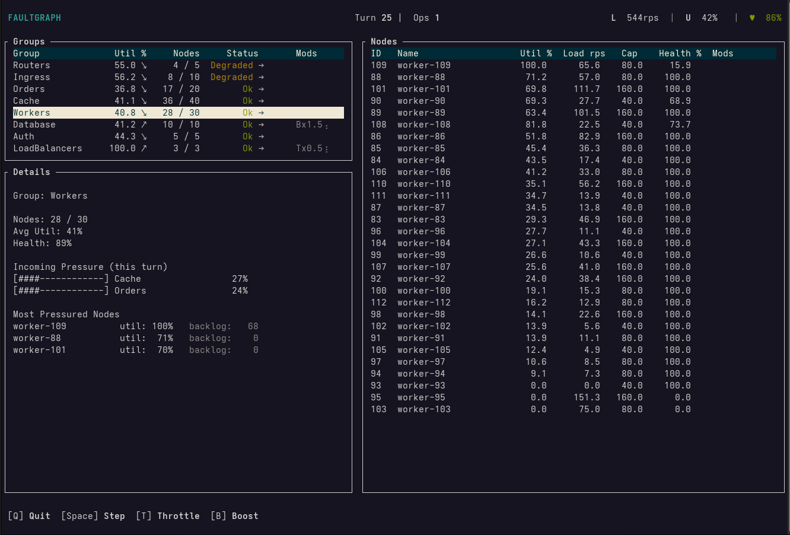

# Faultgraph

A deterministic, turn-based simulation and analysis tool for exploring cascading failures in
distributed systems via a terminal UI.

## Overview

`Faultgraph` simulates how load, capacity limits, and dependencies interact over time in a directed graph.
Failures emerge structurally from topology and pressure, and every outcome is fully explainable.

## Features
- Fully deterministic, reproducible simulation
- Turn-based engine with immutable snapshots
- Structural load propagation (no randomness)
- Cascading failure and recovery mechanics
- Group-based aggregation and pressure analysis
- Incoming pressure breakdown by upstream group
- Interactive, read-only terminal UI
- Built-in scenarios

## Testing

```shell
cargo test 
```

## Running

```shell
cargo run
```

Options:
```shell
cargo run -- -h
```

## Examples

```shell
cargo run -- -s random
```


